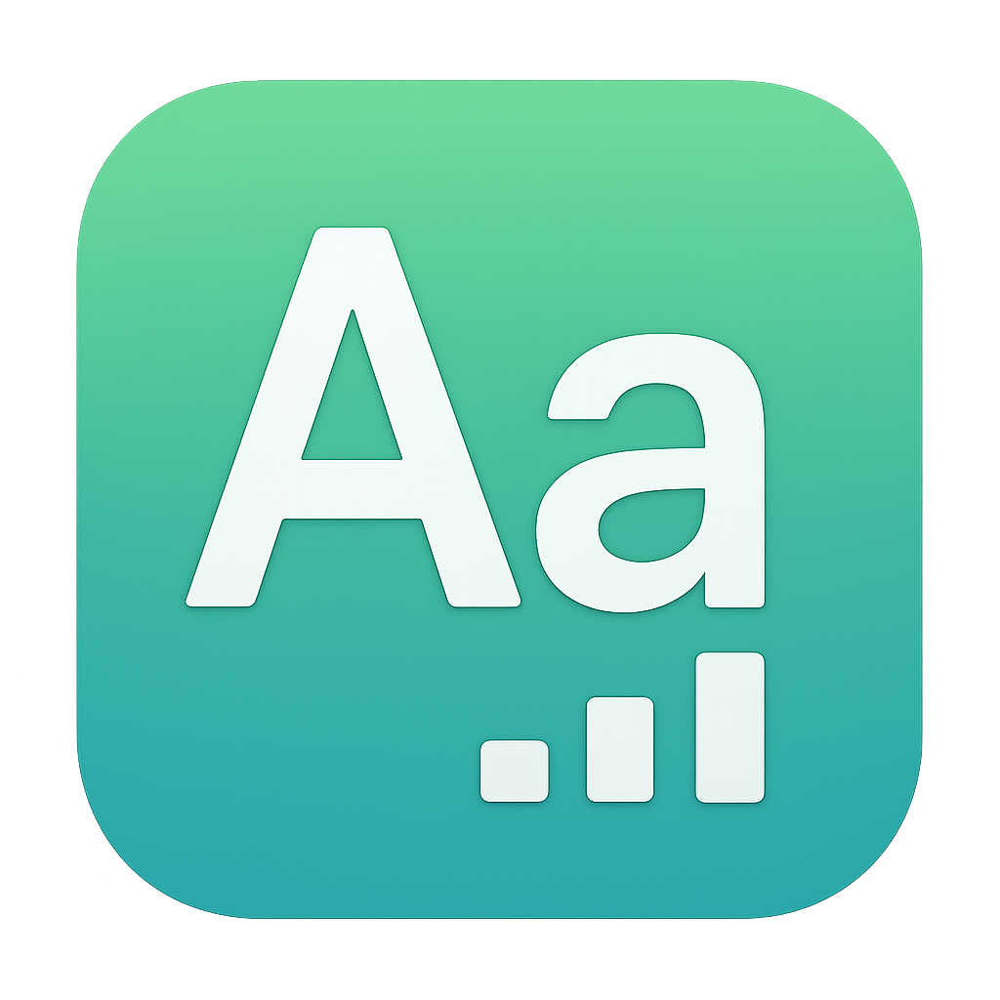

# 文字数カウンター


macOS用のシンプルな文字数カウンターアプリケーションです。Next.js + Electronで構築されています。

## 機能

- シンプルで使いやすいUI
- リアルタイム文字数カウント
- グローバルショートカットキー（Cmd + Shift + Space）でアプリを開く
- テキストのクリア機能
- ウィンドウのタイトルバーを掴んでドラッグ移動可能

## セットアップ

1. 依存関係をインストール:
```bash
npm install
```

2. 開発モードで実行:
```bash
npm run electron-dev
```

3. アプリをビルド:
```bash
npm run build
npm run dist
```

## 使用方法

1. アプリを起動するか、`Cmd + Shift + Space` でアプリを開く
2. テキストエリアに文字を入力
3. 「文字数を計測」ボタンをクリックして文字数を表示
4. 「クリア」ボタンでテキストをクリア
5. ウィンドウのタイトルバーをドラッグしてアプリを移動

## ショートカットキー

- `Cmd + Shift + Space`: アプリを開く/フォーカスする 